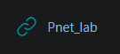
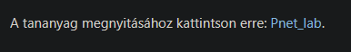
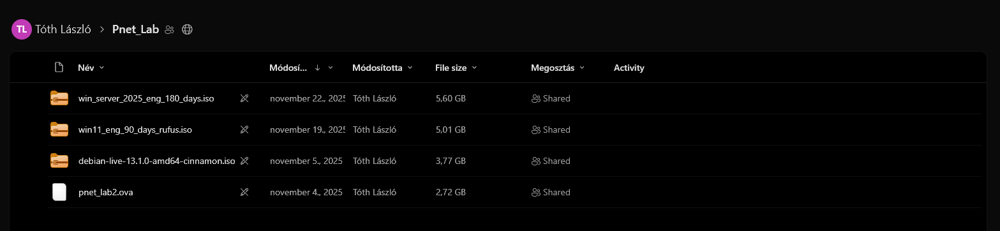
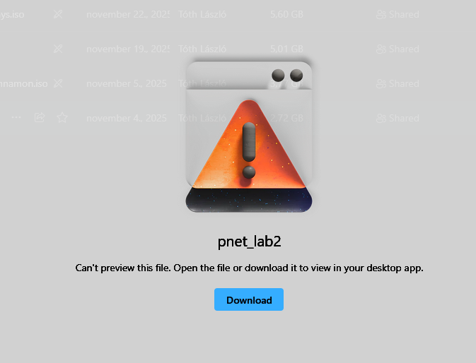
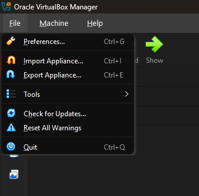
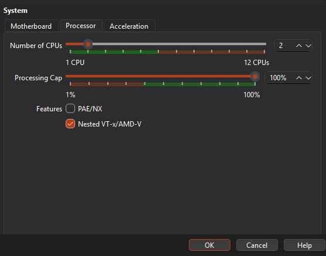
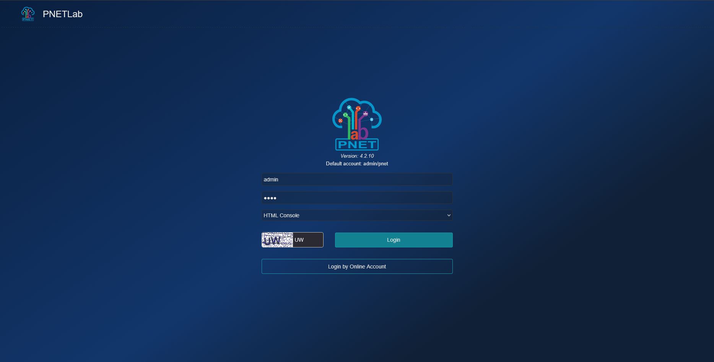
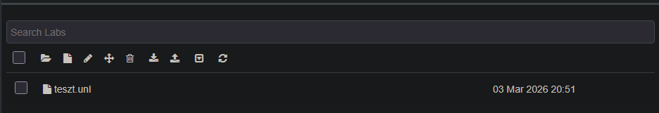
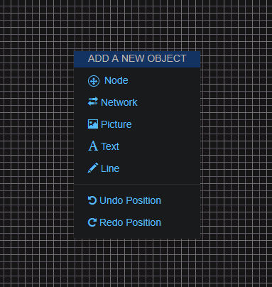

### Donwloading the .ova

> To download the `.ova` go to the moodle page and find the following listed under the docker section

> Download the  `.ova` by clicking `Pnet_lab`

> When you click it you will be redirected to the following [OneDrive page](https://szaleziakk-my.sharepoint.com/personal/tothl_dk_akkszalezi_hu/_layouts/15/onedrive.aspx?id=%2Fpersonal%2Ftothl%5Fdk%5Fakkszalezi%5Fhu%2FDocuments%2FPnet%5FLab&ga=1)

> When you select the `.ova` you will be prompted the following. We continue by ignoring the warning and clicking the download button.

### Setting up the .ova

> Now that we have our `.ova` file we can use `Virtual Box` to import it. To do so select `file` in the top left corner and click on `Import Appliance`

> Select the source of the `.ova` and click on `Finish`

> After you imported the virtual machine go into settings and enable `Nested VT-x/AMD-V`

> After this you can start up the machine

### Using PNETLab

> To reach the `PNETLab` open a browser and in the search bar type [http://localhost](http://localhost)
> You will see the following

>Enter the credentials also for the console select `HTML Console` and hit login

> Select your lab and press `open`

> To add new nodes right click and select `node`

